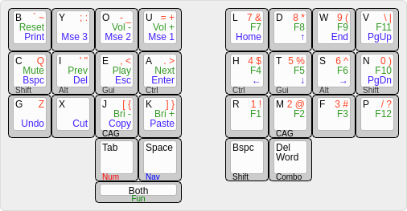

# Dlip's 28 Key Engram Layout

Based on [Arno's Engram v2.0](https://engram.dev/) layout.

## Layers

- Num + Symbols + Q/Z - Combined with shift to access 2nd symbol
- Nav + Editing + Mouse (Automatically activated if touching trackpad)
- Function + Media + Utility

## Dual Function keys

There are some differences in the dual function keys:

- The homerow mods and space use the default style where you must hold the key for a set time (eg. 180 ms) for it to register as a hold. This avoids misfires but does require a short pause which I find acceptable for navigation and mods where you naturally wait for feedback from the application.
- Num and shift use the trigger on other press style making it an instant trigger, the trade off here is you can't 'roll' to another key but I haven't had many issues with tab/bspc
- The combo key is used for typing words with a single chord using [Chordgen](https://dlip.github.io/chordgen/)
