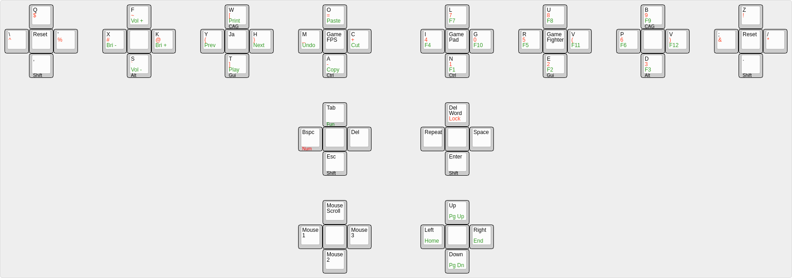

# Stained Layout

## English 'Stained' Layout



## Japanese 'Sumo' Layout


## Design

This is a computer generated layout I created in a fork of keyboard layout optimizer <https://github.com/dlip/keyboard_layout_optimizer> and have designed some new metrics for use with "directional keyboards" like Harite.

This layout is geared towards rolls and mainly using the index, middle and ring fingers, but using the following metrics you can generate layouts suited to your tastes with thumb alphas etc.

Bigram Metrics
Same Finger Scissors: Going North to South or East to west on the same finger
Directional Change: Changing direction on different fingers on the same hand

Trigram Metrics
Same finger rolls: Rolling 2 characters on one finger, then pressing any key on the other hand
Same finger onehands: Rolling 3 characters on 1 finger
Unidirectional Rolls: Rolling 2 characters on different fingers, in the same direction on one hand, then pressing any key on the other hand
Unidirectional Onehands: Rolling 3 characters on different fingers, in same direction on one hand

### Stained Metrics

```txt
          LEFT HAND                         RIGHT HAND

  Pinky   Ring    Middle  Index     Index   Middle  Ring    Pinky

    q       f       w       o         l       u       b       z
  \   '   x   k   y   h   m   c     i   g   r   v   p   j   ;   /
    ,       s       t       a         n       e       d       .

Layout string (layer 1):
fxkswyhtomcalignurvebpjd

Unigram metrics:
  Not found: 0.2689% of 1.0000
    96.51 Finger Balance                      | Finger loads % (no thumb): 1.6 9.5 17.3 21.0 - 20.0 21.7 7.4 1.4
     0.33 Hand Disbalance                     | Hand loads % (no thumb): 49.45 - 50.55
   274.67 Key Costs                           | Worst unigrams: i (10.33%), r ( 8.78%), s ( 6.99%)

Bigram metrics:
  Not found: 0.4501% of 1.0000
     4.67 Same Finger Scissors                | Worst: ig (28.41%), gi (15.29%), ue (13.71%);  Worst non-fixed: ig (28.41%), gi (15.29%), ue (13.71%)
    65.90 Directional Change                  | Worst: to ( 7.17%), ha ( 5.86%), le ( 5.17%);  Worst non-fixed: to ( 7.17%), ha ( 5.86%), le ( 5.17%)

Trigram metrics:
  Not found: 0.8231% of 1.0000
   -26.09 Unidirectional Rolls                | Worst: and ( 6.59%), ent ( 4.58%), for ( 4.42%);  Worst non-fixed: and ( 6.59%), ent ( 4.58%), for ( 4.42%)
    -3.09 Unidirectional Onehands             | Worst: sta (38.07%), den (15.36%), pri (13.72%);  Worst non-fixed: sta (38.07%), den (15.36%), pri (13.72%)
   -71.14 Same Finger Rolls                   | Worst: the (13.70%), her ( 2.38%), ter ( 2.14%);  Worst non-fixed: the (13.70%), her ( 2.38%), ter ( 2.14%)
   -19.55 Same Finger Onehands                | Worst: ing (52.57%), ver (13.64%), com (10.03%);  Worst non-fixed: ing (52.57%), ver (13.64%), com (10.03%)
    69.13 Alternates                          | Worst: tio ( 3.84%), his ( 2.38%), out ( 1.79%);  Worst non-fixed: tio ( 3.84%), his ( 2.38%), out ( 1.79%)
    34.24 Alternates (sfs)                    | Worst: ion ( 9.70%), wit ( 4.83%), ear ( 3.45%);  Worst non-fixed: ion ( 9.70%), wit ( 4.83%), ear ( 3.45%)

Cost: 425.57 (optimization score: 234978)
```

### Sumo Metrics

```
Layout (layer 1):
          LEFT HAND                         RIGHT HAND

  Pinky   Ring    Middle  Index     Index   Middle  Ring    Pinky

    ゛       ト       ン       ハ         タ       シ       ア       ゜
  ー  「   リ  マ   キ  サ   ノ  ツ     ク  ヲ   ヨ  コ   ナ  レ   」  ・
    、       ス       イ       カ         テ       ウ       ニ       。

Layout string (layer 1):
トリマスンキサイハノツカタクヲテシヨコウアナレニ

Unigram metrics:
  Not found: 17.7950% of 172841.0000
    91.34 Finger Balance                      | Finger loads % (no thumb): 0.9 11.5 17.3 21.5 - 17.2 18.8 8.6 4.2
     0.73 Hand Disbalance                     | Hand loads % (no thumb): 51.21 - 48.79
   321.85 Key Costs                           | Worst unigrams: マ ( 7.36%), ノ ( 7.17%), 。 ( 6.56%)

Bigram metrics:
  Not found: 40.7533% of 87485.0000
    12.74 Same Finger Scissors                | Worst: ウシ (40.35%), イン (14.31%), マリ ( 6.36%);  Worst non-fixed: ウシ (40.35%), イン (14.31%), マリ ( 6.36%)
    51.62 Directional Change                  | Worst: カン ( 8.10%), イツ ( 4.89%), ンカ ( 3.84%);  Worst non-fixed: カン ( 8.10%), イツ ( 4.89%), ンカ ( 3.84%)

Trigram metrics:
  Not found: 55.6302% of 43471.0000
   -17.15 Unidirectional Rolls                | Worst: カイシ ( 6.81%), イカク ( 5.86%), シマツ ( 5.86%);  Worst non-fixed: カイシ ( 6.81%), イカク ( 5.86%), シマツ ( 5.86%)
    -2.16 Unidirectional Onehands             | Worst: アシタ (78.12%), ハント ( 7.57%), スイカ ( 4.81%);  Worst non-fixed: アシタ (78.12%), ハント ( 7.57%), スイカ ( 4.81%)
  -117.65 Same Finger Rolls                   | Worst: ノシヨ (10.17%), カノシ (10.15%), キヨウ ( 9.50%);  Worst non-fixed: ノシヨ (10.17%), カノシ (10.15%), キヨウ ( 9.50%)
   -38.71 Same Finger Onehands                | Worst: シヨウ (69.12%), イキン ( 9.97%), サイキ ( 7.61%);  Worst non-fixed: シヨウ (69.12%), イキン ( 9.97%), サイキ ( 7.61%)
    22.01 Alternates                          | Worst: ウカク ( 3.08%), テンシ ( 3.03%), タイシ ( 2.77%);  Worst non-fixed: ウカク ( 3.08%), テンシ ( 3.03%), タイシ ( 2.77%)
    17.82 Alternates (sfs)                    | Worst: ンタイ ( 6.84%), ウキヨ ( 4.45%), ウリヨ ( 3.94%);  Worst non-fixed: ンタイ ( 6.84%), ウキヨ ( 4.45%), ウリヨ ( 3.94%)

Cost: 342.45 (optimization score: 292016)


Layout (layer 2):
          LEFT HAND                         RIGHT HAND

  Pinky   Ring    Middle  Index     Index   Middle  Ring    Pinky

    ゛       ネ       ワ       セ         チ       ラ       ヒ       ゜
  ー  「   「  ヘ   ム  ソ   メ  ミ     ヤ  ヌ   フ  エ   ロ  」   」  ・
    、       モ       オ       ユ         ケ       ル       ホ       。

Layout string (layer 2):
ネヘモワムソオセメミユチヤヌケラフエルヒロホ

Unigram metrics:
  Not found: 77.9757% of 172841.0000
   375.74 Finger Balance                      | Finger loads % (no thumb): 3.3 8.8 14.6 15.6 - 14.8 17.8 9.2 15.8
     4.60 Hand Disbalance                     | Hand loads % (no thumb): 42.34 - 57.66
   344.61 Key Costs                           | Worst unigrams: 。 (22.87%), ー ( 7.32%), エ ( 4.80%)

Bigram metrics:
  Not found: 95.2826% of 87485.0000
     9.21 Same Finger Scissors                | Worst: オワ (39.47%), フエ (25.00%), チケ (11.84%);  Worst non-fixed: オワ (39.47%), フエ (25.00%), チケ (11.84%)
    48.85 Directional Change                  | Worst: ユー (10.52%), ヒル ( 6.35%), ヘー ( 4.56%);  Worst non-fixed: ヒル ( 6.35%), ヒヤ ( 4.56%), ネム ( 3.97%)

Trigram metrics:
  Not found: 98.6543% of 43471.0000
   -31.56 Unidirectional Rolls                | Worst: チーム (34.67%), メール (17.44%), ホーム (10.83%);  Worst non-fixed: オモチ ( 3.03%), ソチラ ( 2.28%), セヒラ ( 2.17%)
    -0.00 Unidirectional Onehands             |
   -60.58 Same Finger Rolls                   | Worst: ーフル (10.16%), モチヌ (10.16%), ミヤケ ( 5.64%);  Worst non-fixed: モチヌ (10.16%), オチヤ ( 5.64%), ミヤケ ( 5.64%)
   -26.12 Same Finger Onehands                | Worst: フルエ (31.41%), ラフル (20.94%), オソワ (18.85%);  Worst non-fixed: フルエ (31.41%), ラフル (20.94%), オソワ (18.85%)
     0.90 Alternates                          | Worst: ホール (23.08%), ヒール (17.95%), ヒーチ ( 7.69%);  Worst non-fixed: ユヒワ ( 6.41%), ヤワラ ( 5.13%), ムチユ ( 3.85%)
     0.97 Alternates (sfs)                    | Worst: ーヒー (14.29%), チオヤ (13.10%), ルーフ (10.71%);  Worst non-fixed: チオヤ (13.10%), ロソロ ( 4.76%), ソロソ ( 4.76%)

Cost: 666.61 (optimization score: 150012)
```
