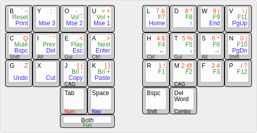

# Dlip's 28 Key Engram Layout

The base layer is based on [Arno's Engram v2.0](https://engram.dev/) layout. I'm not sure if he considered this when he was designing the layout, but it works perfectly for this form factor.

I have avoided using combos as I've seen many other designs use since the homerow combos often caused me misfires and if you move them to less commonly used keys such as the bottom row they are less comfortable than a layer on the thumb.

## Dual Function keys

There are some differences in the dual function keys:

- The homerow mods and space use the default style where you must hold the key for a set time (eg. 180 ms) for it to register as a hold. This avoids misfires but does require a short pause which I find acceptable for navigation and mods where you naturally wait for feedback from the application.
